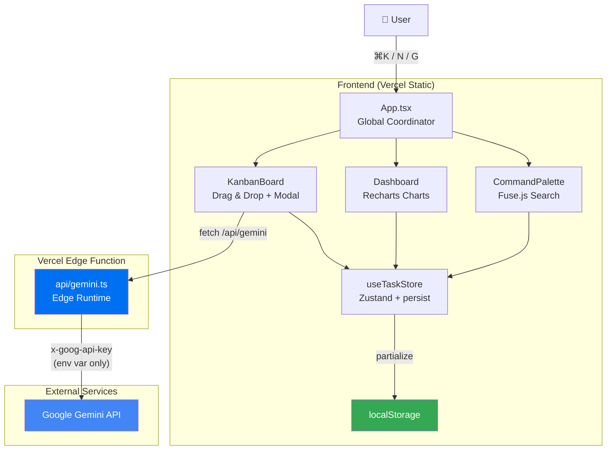

# TaskFlow — Developer Task OS

> A keyboard-first task management tool for developers, featuring AI-powered task breakdown and Git workflow visualization.
> Demonstrates: React 19 architecture, Zustand state management, Vercel Edge Functions, and AI API integration.

[](https://github.com/IcannAI/taskflow-board/actions/workflows/ci.yml)
[](https://opensource.org/licenses/ISC)
[](https://taskflow-board-six.vercel.app)

**[🚀 Live Demo](https://taskflow-board-six.vercel.app)** · **[📋 Roadmap](#roadmap)** · **[🐛 Known Issues](#known-issues)**

---

## 📍 Current Status

> ⚠️ **v0.1 — Frontend Prototype**: Data is stored in localStorage. Git integration is UI simulation only. Backend is planned but not yet implemented.

| Feature | Status | Notes |
|:---|:---|:---|
| Kanban Board + Drag & Drop | ✅ Done | HTML5 Drag & Drop API |
| Command Palette ⌘K | ✅ Done | Fuse.js fuzzy search |
| Dashboard Charts | ✅ Done | Recharts visualization |
| Local Persistence | ✅ Done | Zustand persist → localStorage |
| AI Task Breakdown | ✅ Done | Gemini API via Vercel Edge proxy (key never exposed) |
| Git Integration | 🟡 UI Only | Not a real git operation |
| Backend API | 🔴 Roadmap | Hono + Cloudflare Workers |
| Database | 🔴 Roadmap | Turso (SQLite) |
| CLI Tool | 🔴 Roadmap | Commander.js |

---

## 🎯 What This Project Demonstrates

TaskFlow is a side project built to showcase **React 19 ecosystem integration**, motivated by a real developer pain point:

> "Developers constantly switch between task managers and their IDE. What if Git status, AI planning, and task tracking were unified into a single keyboard-first interface?"

**Engineering capabilities demonstrated:**
- Zero prop-drilling architecture with Zustand
- Vercel Edge Function as a secure API proxy (eliminates client-side key exposure)
- Full TypeScript strict mode coverage
- AI structured output with graceful fallback design

---

## 🏗️ System Architecture



**Data Flow:**
```
User Action → Zustand Action → State Update → Component Re-render
                                     ↓
                              localStorage (auto-synced)

AI Request → geminiService (no key in client)
                  ↓ POST /api/gemini
            Vercel Edge Function (key in env var only)
                  ↓
            Gemini API → Structured JSON → UI
```

---

## 🛠️ Tech Stack

### Current (Implemented)

| Layer | Technology | Version | Why |
|:---|:---|:---|:---|
| Framework | React | 19 | Concurrent features, latest stable |
| Build | Vite | 6 | Near-instant HMR, native ESM |
| Language | TypeScript | 5.8 | Strict mode, full type safety |
| State | Zustand | 5 | Zero boilerplate, persist middleware built-in |
| Styling | Tailwind CSS | 3 | Utility-first, pairs with `cn()` pattern |
| Charts | Recharts | 3 | React-native, composable API |
| Search | Fuse.js | 7 | Lightweight fuzzy search, no backend needed |
| Icons | Lucide React | latest | Tree-shakeable SVG icons |
| AI | @google/genai | latest | Gemini structured output |
| Deploy | Vercel | — | Edge Functions + global CDN |

### Planned (Roadmap)

| Layer | Technology | Rationale |
|:---|:---|:---|
| Backend | Hono (Node.js) | Lightweight, Edge-native, TypeScript-first |
| Database | Turso (SQLite) | Edge-deployed, low latency, generous free tier |
| CLI | Commander.js | Native Node ecosystem integration |
| Git | simple-git | Local `.git` access without GitHub API dependency |
| Testing | Vitest + Playwright | Vite-native integration |

---

## ✨ Core Functionality

### 1. Kanban Board
- Four-column board: `Todo` → `In Progress` → `Review` → `Done`
- Native HTML5 drag and drop for cross-column task movement
- Task cards include: priority badge, Git branch info, and tag labels

### 2. Command Palette (⌘K)
- Fuse.js fuzzy search across task titles, tags, and commands
- Full keyboard navigation: `↑↓` to select, `Enter` to execute, `Esc` to close
- Built-in commands: create task, switch view, Git sync

### 3. AI Task Breakdown
- Input a task title → Gemini returns:
  - 3–5 technical subtasks
  - Git branch name suggestion (Conventional Commits format)
  - Time estimate in hours
- API key proxied through Vercel Edge Function — never bundled into client-side JS

### 4. Dashboard
- Task status distribution (pie chart)
- Priority distribution (bar chart)
- Completion rate statistics

### 5. Local Persistence
- Zustand `persist` middleware → localStorage
- Data survives page refresh
- Only `tasks` are persisted; UI state resets on each load

---

## 🧠 Design Decisions

> Full ADR documentation planned under `docs/adr/` (in progress)

| Decision | Chosen | Rejected | Reason |
|:---|:---|:---|:---|
| State management | Zustand | Redux / Jotai | Zero boilerplate; persist middleware works out of the box |
| AI proxy | Vercel Edge Function | Cloudflare Worker | Same repo, zero-config deployment |
| Persistence | localStorage | IndexedDB | Sufficient for MVP; under 20-line implementation |
| Search | Fuse.js | Algolia / backend search | No backend required; bundle size only 24kb |
| Styling | Tailwind + `cn()` | CSS Modules / styled-components | Compatible with shadcn/ui ecosystem, tree-shakeable |

---

## 🧪 Testing

> ⚠️ **Current coverage: 0%** — This is a known technical debt item. Testing infrastructure is planned for v0.3.

**Planned testing strategy:**

```
Unit Tests (Vitest)
├── store/useTaskStore.test.ts     → addTask / deleteTask / updateTaskStatus
├── lib/utils.test.ts              → cn() helper
└── services/geminiService.test.ts → mock fetch, verify fallback behavior

Component Tests (@testing-library/react)
├── TaskCard.test.tsx
├── TaskModal.test.tsx
└── CommandPalette.test.tsx

E2E Tests (Playwright)
├── drag-and-drop.spec.ts          → drag task across columns
├── command-palette.spec.ts        → ⌘K open, search, execute
└── ai-planning.spec.ts            → mock Gemini, verify UI response
```

---

## ⚡ Quick Start

### Prerequisites
- Node.js 20+
- npm 10+
- Google Gemini API Key ([Get one here](https://aistudio.google.com)) — optional, AI features fall back to mock data without it

### Setup

```bash
# 1. Clone the repo
git clone https://github.com/IcannAI/taskflow-board.git
cd taskflow-board

# 2. Install dependencies
npm install

# 3. Configure environment variables
cp .env.example .env
# Edit .env and fill in your GEMINI_API_KEY

# 4. Start the development server
npx vercel dev   # recommended: includes /api/gemini Edge Function
# or
npm run dev      # frontend only; AI features use fallback mock data
```

Open `http://localhost:3000` in your browser.

### Keyboard Shortcuts

| Action | Mac | Windows |
|:---|:---|:---|
| Command Palette | `⌘K` | `Ctrl+K` |
| New Task | `N` | `N` |
| Git Sync Demo | `G` | `G` |
| Close | `Esc` | `Esc` |

---

## 🗺️ Roadmap

### v0.2 — Architecture Cleanup (In Progress)
- [ ] Decompose KanbanBoard.tsx (~500 LOC god component)
- [ ] Move `openModal` into Zustand store (remove `useRef` coupling)
- [ ] Complete CONTRIBUTING.md + ARCHITECTURE.md
- [ ] GitHub Actions CI (tsc + build + audit)

### v0.3 — Testing Infrastructure
- [ ] Vitest setup + store unit tests
- [ ] Component tests for TaskCard, TaskModal
- [ ] Playwright E2E for critical user paths

### v0.4 — Backend Implementation
- [ ] Hono API server (Cloudflare Workers)
- [ ] Turso database + task CRUD
- [ ] Replace localStorage with real backend persistence

### v1.0 — Real Git Integration
- [ ] Read local `.git` via simple-git
- [ ] Auto-link branches to tasks
- [ ] Sync commit progress to task status

---

## 🐛 Known Issues

| Issue | Severity | Details |
|:---|:---|:---|
| KanbanBoard.tsx ~500 LOC | 🟡 Medium | God component, hard to test; decomposition planned for v0.2 |
| `useRef` coupling in App.tsx | 🟡 Medium | `openModal` passed via ref; breaks if KanbanBoard unmounts; fix in v0.2 |
| Git integration is UI simulation | 🟡 Medium | `Git Sync ⚡` plays animation only; real integration planned for v1.0 |
| Zero test coverage | 🟡 Medium | Testing infrastructure planned for v0.3 |
| Mock data uses dynamic timestamps | 🟢 Low | `new Date()` called at import time; switching to fixed ISO strings in v0.2 |
| `CommandType` uses TypeScript enum | 🟢 Low | Enum tree-shaking issue; migrating to `as const` in v0.2 |

---

## 📄 License

ISC © [IcannAI](https://github.com/IcannAI)